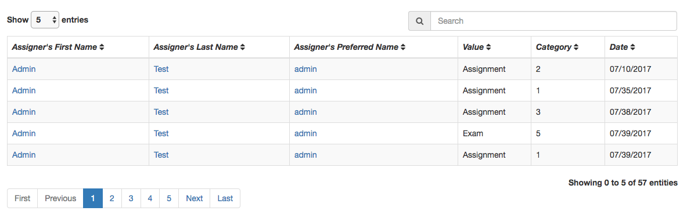

UI Instruction
------------

###Pages

+ **Profile Page**
    + **Views**
        + Basic information of current user
        + Points Dashboard 
        
            + Bar Chart: 
                > Display total points user gained under each category
            + Donut Chart:
                > Display percentage of each category
    + **Operations**
        + edit current user's profile
            
            > Able to edit some basic user profile tsuch as avatar, preferred name, biography.
        + check points history of the current use by clicking **View Details**
        
+ **States Details Page**
    + **Views**
        + data table
            
            > Display points history of the current user
        + Line chart
            
            > Display points history of the current user by time
    + **Operations**
        + data table
            + search records in the search bar
            + sort records
            + choose max number of records that will display for each page
        + Line chart
            + select a time range and display points that assigned to the current user in that range.

+ **LeaderBoard Rank Page**
    + **Views**
        
        + display a leaderboard of points that all users gained for each category
    + **Operations**
        + select a category and display a leaderboard of points for the selected category
        + search records in the search bar
        + sort records
        + choose max number of records that will display each page
     
+ **Manage Products Page**
    + **Views**
        + view products that can be connected with TracademicHub
    + **Operations**
        + Enable/Disable products that connect with TracademicHub.
    
+ **Points History Page**
    + **Views**
        
        + Display all users' points history of each category.
    + **Operations**
        + select a category and display all points history for the selected category
        + search in the search bar
        + sort records
        + choose max number of records that will display each page
            
+ **Management Page**

    1. **User Management Page**
    + **Views**
        + List all users except admins by table views and card views
    + **Operations**
        + Choose to display user records in table view or card view
            
        + Add Users
            
            + Add students by import csv file
            + Create Local Admin
        + Table View
            + search in the search bar
            + sort records
            + choose max number of records that will display each page
            + Display users by different types
                
                + Select a user type to display, otherwise list all users
                + Choose a course and display all users under this course. 
                + Choose a user privilege to display all users with this privilege
            + Perform bulk User operations
                1. choose User Type > Course Type
                2. select several users from table
                    
                3. perform an operation for selected users
                    + delete selected users
                    + modify access privileges
                    + give points
                    + active selected users
            + Perform single User operation
                1. choose User Type > Course Type
                2. select several users from table
                    
                3. perform an operation for selected users
                    + delete user
                    + modify user information
                    + give points
                    + active user
            + Click Each row to view user profile
                
        + Card View
            + Basically the same as Table View
    2. **Course Management Page**
    + **Views**
        + List all courses
    + **Operations**
        + Add a new course
            
        + Display courses by two types
        + search in the search bar
        + choose max number of records that will display each page
        + Edit Course
            1. choose **Active Courses**
            2. click the pencil button
                
            3. click the green button to save changes
                
        + Delete Course
        + Active Course
            1. choose **Inactive Courses**
            2. click the flag button
                
            3. choose a startDate before saving
                
        
    3. **Point Management Page**
    + **Views**
        + List all points categories
        + Assign points to users Section
        + View user(s) that assign points to
    + **Operations**
        + Point Category
            + Add a new point category
                
            + Delete a point category
        + Assign Points
            
            + Enter Points Value in any point category cards
            + Get Users that assign points to (Two ways)
                + Select several/single user(s) and click give points button follow instructions above
                + Add User to the list by enter user student number
                    
            + Click **Give Points** button
        + Assignees table
            + Clear All assignees by clicking **Clear All Users** button
            + Remove one assignee from table
            + Click each row to display profile of this assignee
                
            

###Authentication

+ **User Privileges**
    + **4 built-in Privileges**
        > Admin > Instructor > Teaching Assistance > Student
        1. **Admin**
            + **Pages**
                > have access to all pages
            + **Operations**
                > have access to all operations
        2. **Insturctor**
            + **Pages**
                > have access to all pages
            + **Operations**
                > have access to all operations except for **Add Local User**
        3. **Teaching Assistance**
            + **Blocked Pages**
                + Manage Products
                + Points History
                + Management > Course Management
            + **Blocked Operations**
                + Edit Profile
                    1. edit firstName, lastName, email, user privilege
                + Management > User Management
                    1. add/de-active/active users
                    2. edit user profile
                + Management > Point Management
                    1. add/delete points category
        4. **Student**
            + **Pages**
                + Profile
                + States Details
                + LeaderBoard
            + **Operations**
                + Edit Profile
                    + Edit preferredName, biography, avatar
    + **User Privilege Modification**
        + **Management > User Management**
            + Modify User Privilege for several users
                1. choose User Type > Course Type
                2. select several users from table and click Modify Access
                    
                3. choose a course and privilege for selected users
                    
            + Modify User Privilege for single users
                1. choose User Type > Course Type
                2. click Edit button
                    .
                3. choose a course and privilege for the user in edit profile dialog box
                    .

